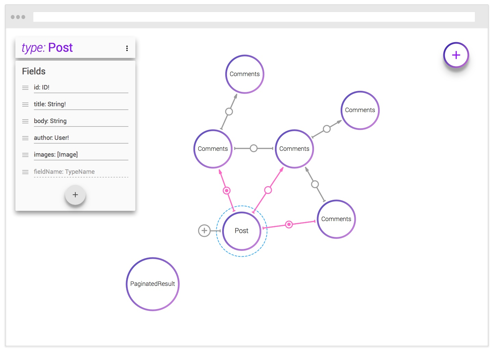

# GraphQL Explorer

GraphQL Explorer is an application that helps you define entities related to your business domains, relate them, and then generate GraphQL schemas that can be used to connect different parts of your software, such as client and server.

## Demo app

Through the following URL you can find a demo app: https://graphql-explorer-rbuvohuudm.now.sh/

## Pre-requirements

- [git](https://git-scm.com/downloads)
- [Node.js](https://nodejs.org/en/) LTS version

## Cloning the project:

In the terminal of your computer, run `git clone https://github.com/sebas5384/graphql-explorer.git`.

After cloning the repo, access the directory of it and then follow the installation instructions below.

## Installation

Run `yarn` to install the application dependencies and dev dependencies.

## Initializing the local environment

Run `yarn start` to start the application in dev mode on your own computer.

If everything run as expected, the application should be automatically opened in your default browser in the following address: http://localhost:3000/, and you should see something like this:

## How it works

TBD.

## Contributing

You can contribute to this project in the following ways:

- Finding and reporting bugs
- Fixing bugs or implementing new features
- Improving the documentation
- Improving the code structure

### Steps to contribute

- [Fork](https://help.github.com/articles/fork-a-repo/) this repository to your own GitHub account and then [clone](https://help.github.com/articles/cloning-a-repository/) it to your computer;
- Install the project and dev dependencies (run `yarn`);
- Make the necessary changes and ensure that the tests are passing using `yarn test` (implement new tests if needed);
- Send a [pull request](https://help.github.com/articles/about-pull-requests/) and I'll be happy to review it 🙌;
- Wait for feedback or approval (this should not take too long).